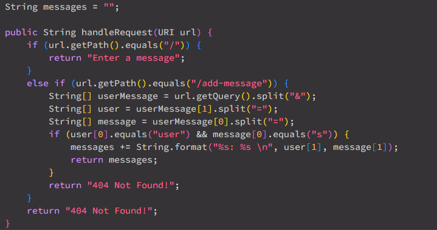
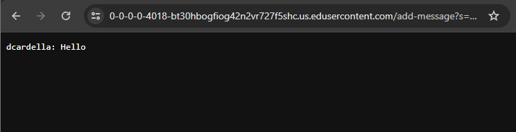
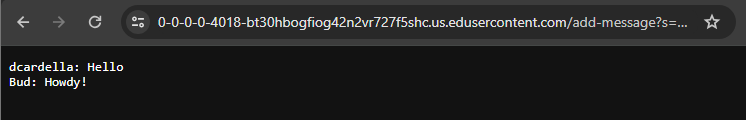
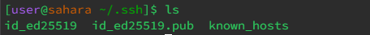
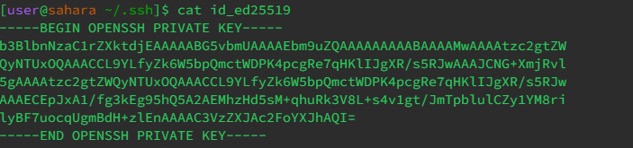
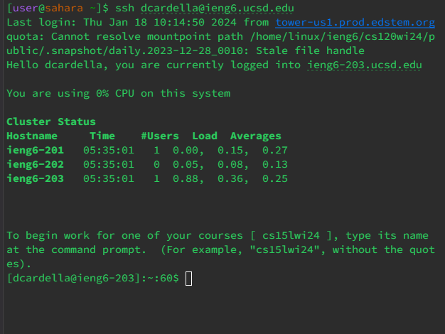

# Lab Report 2

## Part 1: Chat Server

### ChatServer code

These are the changes I made to the `handleRequest` method within `ChatServer.java`

### Writing a Message

When the user adds a chat message, the `handleRequest` method is called with the user-given URL as an argument. The method parses the URL to find a username and a message. Then, the messages field within the `Handler` class is updated to contain the username and message information.

### Adding a New Message

When a user adds another chat message, the `handleRequest` method is called again. Once again, the URL is passed to the `handleRequest` method and parsed to find the username and message information. Now, the messages field is updated to add the new username and message information, while keeping all previous messages. 

## Part 2: SSH Public and Private Keys

### Private Key

The file with the private key is `id_ed25519`. It's located within the `/home/.ssh` folder within my Edstem workspace. 

Above we can see the actual contents of the file containing the private key. 

### Public Key

The file with the public key is `authorized_keys`. It's located within `/home/.ssh` in `ieng6`. 

Above we can see the contents of the `authorized_keys` file which contains the public key.

### SSH Without Password

Since we have the public and private keys in the correct locations, we can now remotely ssh into `ieng6` without a password.

## Part 3: Things I Learned

I learned that it's possbile to set up a remote server in a way that allows you to `ssh` into it without having to enter a password. 
